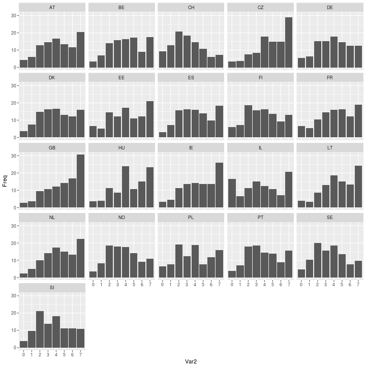
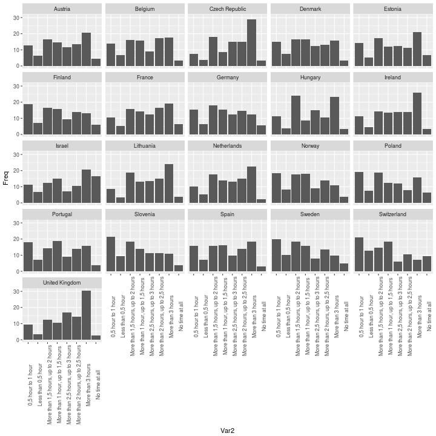
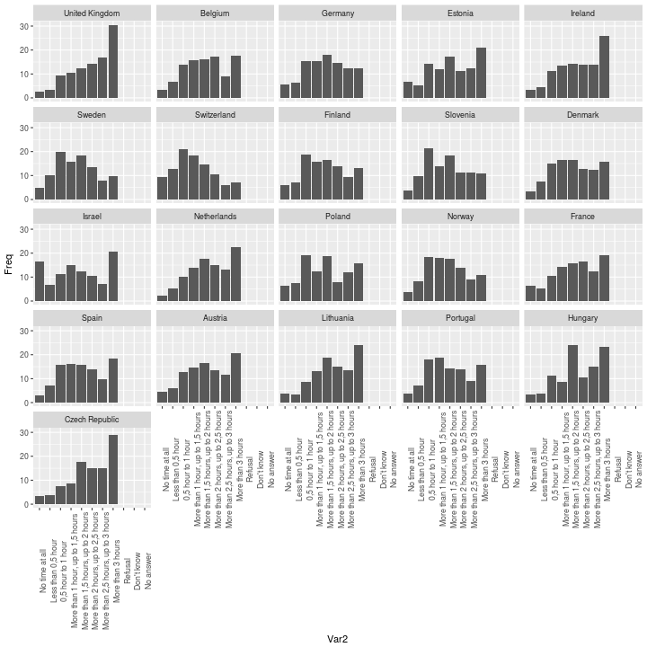
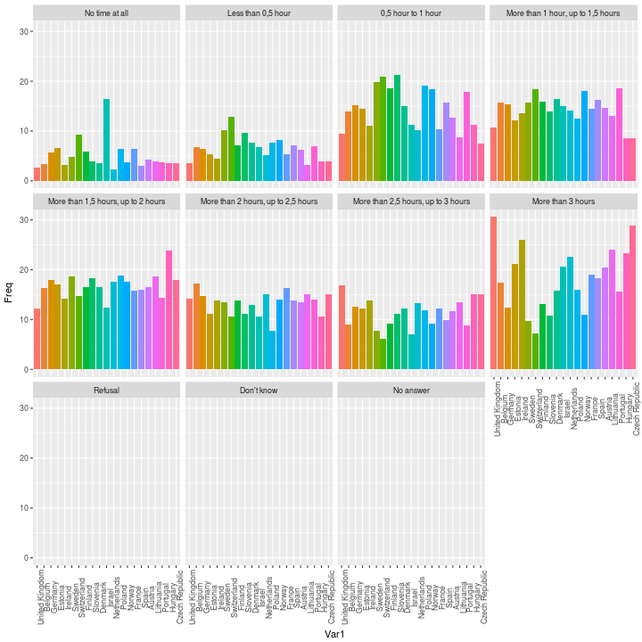
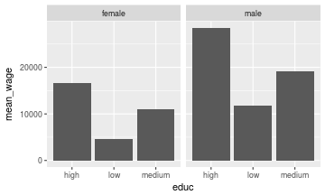
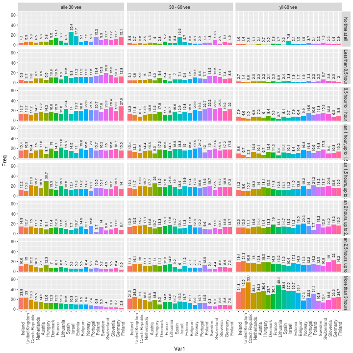

# Functions to Generate Tidy Metadata from SPSS, Stata and SAS binary data files

If not familiar with tidy data, please read:

- [Wickham, Hadley. 2014. ‘Tidy Data’. Journal of Statistical Software 59 (10). doi:10.18637/jss.v059.i10.](http://vita.had.co.nz/papers/tidy-data.html)
- [R for Data Science: Tidy Data](http://r4ds.had.co.nz/tidy-data.html)

# Download original source files from ESS

Ladataan European Social Survey data <http://www.europeansocialsurvey.org/data/> (purin ja siirsin tilapäisesti kapsin palvelimelle <http://muuankarski.kapsi.fi/kela_tmp/>), luetaan R:ään ja printataan ekan 7 muuttujan 6 ekaa tapausta ja **rakenne***


|name      | essround|edition |proddate   | idno|cntry | tvtot|
|:---------|--------:|:-------|:----------|----:|:-----|-----:|
|ESS7e02_1 |        7|2.1     |01.12.2016 |    1|AT    |     4|
|ESS7e02_1 |        7|2.1     |01.12.2016 |    2|AT    |     7|
|ESS7e02_1 |        7|2.1     |01.12.2016 |    3|AT    |     6|
|ESS7e02_1 |        7|2.1     |01.12.2016 |    4|AT    |     3|
|ESS7e02_1 |        7|2.1     |01.12.2016 |    5|AT    |     2|
|ESS7e02_1 |        7|2.1     |01.12.2016 |    6|AT    |     2|

```
## Classes 'tbl_df', 'tbl' and 'data.frame':	40185 obs. of  7 variables:
##  $ name    : atomic  ESS7e02_1 ESS7e02_1 ESS7e02_1 ESS7e02_1 ...
##   ..- attr(*, "label")= chr "Title of dataset"
##   ..- attr(*, "format.spss")= chr "A12"
##  $ essround: atomic  7 7 7 7 7 7 7 7 7 7 ...
##   ..- attr(*, "label")= chr "ESS round"
##   ..- attr(*, "format.spss")= chr "F2.0"
##  $ edition : atomic  2.1 2.1 2.1 2.1 ...
##   ..- attr(*, "label")= chr "Edition"
##   ..- attr(*, "format.spss")= chr "A3"
##  $ proddate: atomic  01.12.2016 01.12.2016 01.12.2016 01.12.2016 ...
##   ..- attr(*, "label")= chr "Production date"
##   ..- attr(*, "format.spss")= chr "A10"
##  $ idno    : atomic  1 2 3 4 5 6 7 13 14 21 ...
##   ..- attr(*, "label")= chr "Respondent's identification number"
##   ..- attr(*, "format.spss")= chr "F9.0"
##  $ cntry   :Class 'labelled'  atomic [1:40185] AT AT AT AT ...
##   .. ..- attr(*, "label")= chr "Country"
##   .. ..- attr(*, "format.spss")= chr "A2"
##   .. ..- attr(*, "labels")= Named chr [1:21] "GB" "BE" "DE" "EE" ...
##   .. .. ..- attr(*, "names")= chr [1:21] "United Kingdom" "Belgium" "Germany" "Estonia" ...
##  $ tvtot   :Class 'labelled'  atomic [1:40185] 4 7 6 3 2 2 7 3 4 5 ...
##   .. ..- attr(*, "label")= chr "TV watching, total time on average weekday"
##   .. ..- attr(*, "format.spss")= chr "F2.0"
##   .. ..- attr(*, "labels")= Named num [1:11] 0 1 2 3 4 5 6 7 77 88 ...
##   .. .. ..- attr(*, "names")= chr [1:11] "No time at all" "Less than 0,5 hour" "0,5 hour to 1 hour" "More than 1 hour, up to 1,5 hours" ...
```

## Create "tidy metadata"

Sitten luodaan `meta` data eli ns. *tidy* metadata-data. Eli siis jossa on `faktoreista` **yksi rivi per yhden muuttujan vastausvaihtoehto**. Numeerisista- ja character-muuttujista on vain yksi rivi per muuttuja.


```r
library(tidyverse)
library(labelled)
meta <- data_frame()
for (i in 1:ncol(d)){
  code  <- names(d[i])
  name <- attributes(d[[i]])$label
  label <- names(attributes(d[[i]])$labels)
  if (is.null(label)){
    value = NA
    label=NA
  } else {
    value = attributes(d[[i]])$labels
    names(value) <- NULL
  }
  if (is.null(name)) name="not applicaple"
  class <- ifelse(is.na(value), "numeric", "factor")
  if (class == "numeric") class <- ifelse(class(d[[i]]) %in% "numeric", "numeric", "character") 
  new_row <- data_frame(code=code,
                   name=name,
                   label=label,
                   value=value,
                   class=class)
  meta <- rbind(meta,new_row) # korjaa tää!!!
}

knitr::kable(meta[1:15,])
```


|code     |name                               |label          |value |class     |
|:--------|:----------------------------------|:--------------|:-----|:---------|
|name     |Title of dataset                   |NA             |NA    |character |
|essround |ESS round                          |NA             |NA    |numeric   |
|edition  |Edition                            |NA             |NA    |character |
|proddate |Production date                    |NA             |NA    |character |
|idno     |Respondent's identification number |NA             |NA    |numeric   |
|cntry    |Country                            |United Kingdom |GB    |factor    |
|cntry    |Country                            |Belgium        |BE    |factor    |
|cntry    |Country                            |Germany        |DE    |factor    |
|cntry    |Country                            |Estonia        |EE    |factor    |
|cntry    |Country                            |Ireland        |IE    |factor    |
|cntry    |Country                            |Sweden         |SE    |factor    |
|cntry    |Country                            |Switzerland    |CH    |factor    |
|cntry    |Country                            |Finland        |FI    |factor    |
|cntry    |Country                            |Slovenia       |SI    |factor    |
|cntry    |Country                            |Denmark        |DK    |factor    |

Same can be achieved with function `tidymetadata::create_metadata()`-function


```r
meta <- tidymetadata::create_metadata(d)
knitr::kable(meta[1:15,])
```


|code     |name                               |label          |value |class     |
|:--------|:----------------------------------|:--------------|:-----|:---------|
|name     |Title of dataset                   |NA             |NA    |character |
|essround |ESS round                          |NA             |NA    |numeric   |
|edition  |Edition                            |NA             |NA    |character |
|proddate |Production date                    |NA             |NA    |character |
|idno     |Respondent's identification number |NA             |NA    |numeric   |
|cntry    |Country                            |United Kingdom |GB    |factor    |
|cntry    |Country                            |Belgium        |BE    |factor    |
|cntry    |Country                            |Germany        |DE    |factor    |
|cntry    |Country                            |Estonia        |EE    |factor    |
|cntry    |Country                            |Ireland        |IE    |factor    |
|cntry    |Country                            |Sweden         |SE    |factor    |
|cntry    |Country                            |Switzerland    |CH    |factor    |
|cntry    |Country                            |Finland        |FI    |factor    |
|cntry    |Country                            |Slovenia       |SI    |factor    |
|cntry    |Country                            |Denmark        |DK    |factor    |


## Stripping data from attributes

Sitten poistetaan kaikki attribuutit itse survey-datasta ja jäljelle jää vaan numeeriset arvot (+ character vektoreiden tekstit)


```r
# remove_attributes
dd <- d
for (i in 1:ncol(dd)) {
  z<-class(dd[[i]])
  if (z[[1]]=='labelled'){
    class(dd[[i]]) <- z[-1]
    attr(dd[[i]],'labels')<-NULL
  }
  attr(dd[[i]],'names')<-NULL
  attr(dd[[i]],'label')<-NULL
  attr(dd[[i]],'format.stata')<-NULL
  attr(dd[[i]],'format.spss')<-NULL
}
knitr::kable(head(dd[,1:7]))
```


|name      | essround|edition |proddate   | idno|cntry | tvtot|
|:---------|--------:|:-------|:----------|----:|:-----|-----:|
|ESS7e02_1 |        7|2.1     |01.12.2016 |    1|AT    |     4|
|ESS7e02_1 |        7|2.1     |01.12.2016 |    2|AT    |     7|
|ESS7e02_1 |        7|2.1     |01.12.2016 |    3|AT    |     6|
|ESS7e02_1 |        7|2.1     |01.12.2016 |    4|AT    |     3|
|ESS7e02_1 |        7|2.1     |01.12.2016 |    5|AT    |     2|
|ESS7e02_1 |        7|2.1     |01.12.2016 |    6|AT    |     2|

Same can be achieved using function `tidymetadata::strip_attributes()`


```r
dat <- tidymetadata::strip_attributes(d)
knitr::kable(head(d[,1:7]))
```


|name      | essround|edition |proddate   | idno|cntry | tvtot|
|:---------|--------:|:-------|:----------|----:|:-----|-----:|
|ESS7e02_1 |        7|2.1     |01.12.2016 |    1|AT    |     4|
|ESS7e02_1 |        7|2.1     |01.12.2016 |    2|AT    |     7|
|ESS7e02_1 |        7|2.1     |01.12.2016 |    3|AT    |     6|
|ESS7e02_1 |        7|2.1     |01.12.2016 |    4|AT    |     3|
|ESS7e02_1 |        7|2.1     |01.12.2016 |    5|AT    |     2|
|ESS7e02_1 |        7|2.1     |01.12.2016 |    6|AT    |     2|


## Labelling the numeric data with function `tidymwetadata::label_data()`


```r
d$new_var <- tidymetadata::label_data(d, variable.data="cntry", metadata=meta, into.factor=FALSE)
head(d[c("cntry","new_var")])
```

```
## # A tibble: 6 × 2
##       cntry new_var
##   <chr+lbl>   <chr>
## 1        AT Austria
## 2        AT Austria
## 3        AT Austria
## 4        AT Austria
## 5        AT Austria
## 6        AT Austria
```


## Esimerkki: Television katselu maittain

### Numeerisella ainestolla


```r
dat <- as.data.frame(prop.table(table(d$cntry,d$tvtot),1)*100)
ggplot(dat, aes(x=Var2,y=Freq)) + geom_col() + facet_wrap(~Var1)
```



### Labeloidulla ainestolla (into.factor = FALSE)


```r
library(tidymetadata)
d$maa <- label_data(data = d, variable.data = "cntry", metadata = meta, into.factor = FALSE)
d$tv <- label_data(data = d, variable.data = "tvtot", metadata = meta, into.factor = FALSE)

dat <- as.data.frame(prop.table(table(d$maa,d$tv),1)*100)
ggplot(dat, aes(x=Var2,y=Freq)) + geom_col() + facet_wrap(~Var1) + theme(axis.text.x = element_text(angle=90))
```



Järjestys siis akkkos eli epälooginen tulkinnan kannalta!

### Labeloidulla ainestolla (into.factor = TRUE)


```r
library(tidymetadata)
d$maa <- label_data(data = d, variable.data = "cntry", metadata = meta, into.factor = TRUE)
d$tv <- label_data(data = d, variable.data = "tvtot", metadata = meta, into.factor = TRUE)

dat <- as.data.frame(prop.table(table(d$maa,d$tv),1)*100)
ggplot(dat, aes(x=Var2,y=Freq)) + geom_col() + facet_wrap(~Var1) + theme(axis.text.x = element_text(angle=90))
```




### Labeloidulla muuttujat toisin päin (into.factor = TRUE)


```r
library(tidymetadata)
d$maa <- label_data(data = d, variable.data = "cntry", metadata = meta, into.factor = TRUE)
d$tv <- label_data(data = d, variable.data = "tvtot", metadata = meta, into.factor = TRUE)

dat <- as.data.frame(prop.table(table(d$maa,d$tv),1)*100)
ggplot(dat, aes(x=Var1,y=Freq,fill=Var1)) + geom_col() + facet_wrap(~Var2) + theme(axis.text.x = element_text(angle=90), legend.position="none")
```




### Labeloidulla muuttujat toisin päin (into.factor = TRUE)


```r
library(tidymetadata)
d$maa <- label_data(data = d, variable.data = "cntry", metadata = meta, into.factor = TRUE)
d$tv <- label_data(data = d, variable.data = "tvtot", metadata = meta, into.factor = TRUE)
library(forcats)
# pudotetaan tyhjät levelit refulsal ja dont know!
d$maa <- fct_drop(d$maa)
d$tv <- fct_drop(d$tv)

dat <- as.data.frame(prop.table(table(d$maa,d$tv),1)*100)
# muokataan maa sen mukaan, joissa katsotaan eniten "more than 3 hours" teeveetä
dat$Var1 <- factor(dat$Var1, levels=dat %>% filter(Var2 %in% "More than 3 hours") %>% arrange(desc(Freq)) %>% .$Var1 %>% as.character())
ggplot(dat, aes(x=Var1,y=Freq,fill=Var1)) + geom_col() + facet_wrap(~Var2) + theme(axis.text.x = element_text(angle=90), legend.position="none")
```




## Uusien muuttujien tekeminen ja lisääminen dataan ja metadataan

### Luodaan uudet muuttujat age ja age_class

Usein tehdään uusia muuttujia, ja tässä näytetään miten tehdään ikäluokkamuuttuja ja lisätään se metadataan. Ja luokat siis:

1. alle 30 vee
1. 30 - 60 vee
1. yli 60 vee


```r
# Luodaan uusi muuttuja
d$age <- 2014 - d$yrbrn
d$age_class[d$age < 30] <- 1
d$age_class[d$age >= 30 & d$age <= 60] <- 2
d$age_class[d$age > 60] <- 3
```

## Lisätään uudet muuttujat metadataan


```r
# Age
library(tidymetadata)
meta <- tidymetadata::add_to_metadata(code="age",
                                       name="Age of the person in 2014",
                                       label=NA,
                                       value=NA,
                                       class="numeric")
# Age class
meta <- tidymetadata::add_to_metadata(code=rep("age_class",3),
                                      name=rep("Age of the person in 2014 in three classes",3),
                                       label=c("alle 30 vee","30 - 60 vee","yli 60 vee"),
                                       value=c("1","2","3"),
                                       class=rep("factor",3))
knitr::kable(tail(meta))
```


|code      |name                                                              |label       |value |class   |
|:---------|:-----------------------------------------------------------------|:-----------|:-----|:-------|
|pspwght   |Post-stratification weight including design weight                |NA          |NA    |numeric |
|pweight   |Population size weight (must be combined with dweight or pspwght) |NA          |NA    |numeric |
|age       |Age of the person in 2014                                         |NA          |NA    |numeric |
|age_class |Age of the person in 2014 in three classes                        |alle 30 vee |1     |factor  |
|age_class |Age of the person in 2014 in three classes                        |30 - 60 vee |2     |factor  |
|age_class |Age of the person in 2014 in three classes                        |yli 60 vee  |3     |factor  |

### Testataan television katselua ikäluokittain eri maissa

Sortataan maat nuorimman ikäluokan eniten katselevien mukaan


```r
library(tidymetadata)
d$maa <- label_data(data = d, variable.data = "cntry", metadata = meta, into.factor = TRUE)
d$tv <- label_data(data = d, variable.data = "tvtot", metadata = meta, into.factor = TRUE)
d$ikaluokka <- label_data(data = d, variable.data = "age_class", metadata = meta, into.factor = TRUE)

library(forcats)
# pudotetaan tyhjät levelit refulsal ja dont know!
d$maa <- fct_drop(d$maa)
d$tv <- fct_drop(d$tv)

dat <- as.data.frame(prop.table(table(d$maa,d$ikaluokka,d$tv),c(1,2))*100)
# muokataan maa sen mukaan, joissa katsotaan eniten "more than 3 hours" teeveetä
dat$Var1 <- factor(dat$Var1, levels=dat %>% filter(Var2 %in% "alle 30 vee", Var3 %in% "More than 3 hours") %>% arrange(desc(Freq)) %>% .$Var1 %>% as.character())
ggplot(dat, aes(x=Var1,y=Freq,fill=Var1)) + 
  geom_col() + 
  facet_grid(Var3~Var2) + 
  theme(axis.text.x = element_text(angle=90), legend.position="none") + 
  geom_text(aes(label=round(Freq,1)), angle=90, size=2.4, nudge_y = 10)
```



